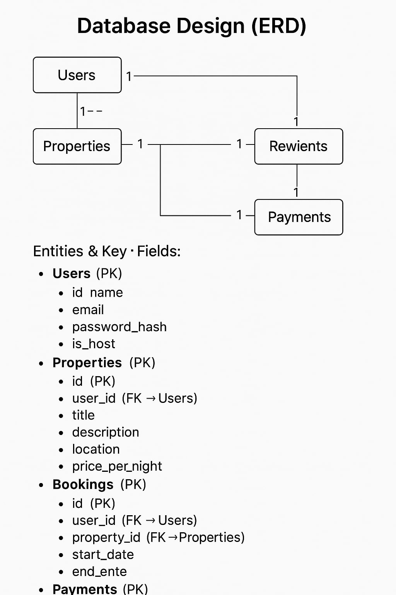

# airbnb-clone-project
#The Airbnb Clone Project is a comprehensive, real-world application designed to simulate the development of a robust booking platform like Airbnb. It involves a deep dive into full-stack development, focusing on backend systems, database design, API development, and application security.

## Team Roles
### Backend Developer
Responsible for building the server-side logic, APIs, and database interactions. Ensures data is processed correctly and securely.

### Frontend Developer
Implements the user interface based on the design. Works closely with the UI/UX Designer and connects frontend components to backend APIs.

### Database Administrator (DBA)
Manages database setup, performance, backups, and security. Ensures data is structured efficiently and is accessible to the backend.

### Project Manager
Oversees the project timeline, team coordination, and communication. Ensures that milestones are met and tasks are aligned with project goals.

### QA Engineer
Tests the software to identify bugs and verify functionality. Works to ensure the final product meets quality standards.

### UI/UX Designer
Designs intuitive and appealing user interfaces. Focuses on user experience, usability, and layout of the application.

### DevOps Engineer
Manages the deployment pipeline, infrastructure, and automation tools. Ensures continuous integration and delivery (CI/CD) is in place.

## Technology Stack

- **Django**: A high-level Python web framework used to build robust and scalable backend APIs. It supports rapid development and clean, pragmatic design, making it ideal for RESTful services.

- **MySQL**: A widely-used open-source relational database management system used for storing, retrieving, and managing structured application data.

- **Docker**: A containerization platform that allows the application and its services to run in isolated environments, ensuring consistency across different development and production setups.

- **GitHub Actions**: A CI/CD tool integrated with GitHub used to automate workflows such as testing, building, and deploying the backend application. It helps maintain code quality and streamline the release process.

- **CI/CD (Continuous Integration/Continuous Deployment)**: A development practice integrated using tools like GitHub Actions to automatically build, test, and deploy code, ensuring frequent and reliable software delivery.

- **Security Best Practices**: Backend development incorporates security considerations such as authentication, data validation, encryption, and protection against common web vulnerabilities (e.g., SQL injection, XSS).

- **Database Design**: Proper schema design and normalization are applied to ensure efficient data storage, retrieval, and relationships between entities.

## Database Design

The database is designed to support core features such as user authentication, property listings, bookings, payments, and user-generated reviews. Below are the main entities and their key fields:

### Users
- `id` (Primary Key)
- `name`
- `email`
- `password_hash`
- `is_host` (Boolean to differentiate between guests and property owners)

### Properties
- `id` (Primary Key)
- `user_id` (Foreign Key → Users)
- `title`
- `description`
- `location`
- `price_per_night`

### Bookings
- `id` (Primary Key)
- `user_id` (Foreign Key → Users)
- `property_id` (Foreign Key → Properties)
- `start_date`
- `end_date`
- `status` (e.g., pending, confirmed, cancelled)

### Reviews
- `id` (Primary Key)
- `user_id` (Foreign Key → Users)
- `property_id` (Foreign Key → Properties)
- `rating` (e.g., 1–5 stars)
- `comment`

### Payments
- `id` (Primary Key)
- `booking_id` (Foreign Key → Bookings)
- `amount`
- `payment_method`
- `payment_status` (e.g., paid, refunded, pending)

### Entity Relationships
- A **User** can list multiple **Properties** (if they are a host).
- A **User** can make multiple **Bookings**.
- A **Booking** belongs to one **Property** and one **User**.
- A **Review** is written by a **User** for a **Property**.
- A **Payment** is linked to a specific **Booking**.

## Feature Breakdown

### 🧑‍💼 User Management
This feature allows users to register, log in, and manage their profiles. It includes support for both guests and hosts, enabling role-based access to features such as property listings or bookings.

### 🏡 Property Management
Hosts can create, update, and delete property listings. Each listing includes details like title, description, location, pricing, and availability, which are essential for attracting and informing potential guests.

### 📅 Booking System
Guests can view available properties and make bookings by selecting their preferred dates. The system ensures that date conflicts are handled and records are properly maintained for both guests and hosts.

### ⭐ Review & Rating System
After a stay, guests can leave reviews and ratings for properties. This feature promotes trust and helps other users make informed decisions based on past experiences.

### 💳 Payment Processing
Secure payment processing is integrated to handle transactions between guests and hosts. It ensures that bookings are confirmed only after successful payment, contributing to the platform's reliability and trustworthiness.

## 🔐 API Security

Securing the backend APIs is critical to protect sensitive user data, maintain trust, and ensure the platform functions as intended. The following key security measures will be implemented:

### 🔑 Authentication
Only verified users can access protected endpoints using methods like token-based authentication (e.g., JWT). This ensures that only valid users can perform actions such as booking properties or managing listings.

### 🛂 Authorization
Role-based access control (RBAC) will be used to ensure users only perform actions they’re allowed to. For instance, only hosts can create or edit properties, while guests can only make bookings.

### 🚫 Rate Limiting
Rate limiting protects the API from abuse and brute-force attacks by limiting the number of requests a user or IP can make within a given timeframe. This helps maintain performance and prevents denial-of-service (DoS) attacks.

### 🔒 Data Protection
Sensitive data such as passwords will be hashed, and all communication will be encrypted using HTTPS. This prevents interception and ensures user data like login credentials and payment details remain secure.

### 🧾 Secure Payments
All payment processing will use trusted third-party gateways and adhere to security standards like PCI-DSS. This ensures financial data is not stored insecurely and prevents fraud or data leaks.

Implementing these measures ensures the integrity, availability, and confidentiality of the platform's services and user data.

## 🚀 CI/CD Pipeline

Continuous Integration and Continuous Deployment (CI/CD) pipelines automate the process of building, testing, and deploying code. They ensure that changes pushed to the codebase are automatically validated and safely delivered to production or staging environments with minimal human intervention.

Implementing CI/CD is crucial for this project as it:
- Reduces human error by automating testing and deployment.
- Speeds up development by providing immediate feedback on code changes.
- Ensures consistency across environments.
- Improves code quality through automated linting, testing, and review processes.

### 🛠 Tools
- **GitHub Actions**: Used to run tests, check code quality, and automate deployments.
- **Docker**: Containerizes the application to ensure consistency across development, testing, and production environments.
- **Docker Hub / GitHub Container Registry**: For storing and sharing Docker images.

These tools help us maintain a streamlined and reliable development workflow.
